# Autobuska Stanica – Rezervacije i Prodaja Karata

Dobrodošli u korisničko uputstvo aplikacije **Autobuska Stanica**. Ova aplikacija je razvijena s ciljem da olakša prodaju i upravljanje autobuskim kartama, omogućavajući jednostavno pretraživanje ruta, kupovinu karata, pretraživanje putnika i upravljanje voznim redovima.

## Svrha aplikacije
Aplikacija je dizajnirana za:
- Radnike autobuske stanice
- Administratore

Pruža intuitivan i efikasan način za vođenje evidencije o prodaji karata, prevoznicima i putnicima.

## Funkcionalnosti aplikacije

Aplikacija omogućava različite funkcionalnosti zavisno od tipa korisnika: korisnici (operateri/prodavači) i administratori.

### Korisničke funkcije koje su namenjene radnicima koji prodaju karte i upravljaju rezervacijama

#### 1. Pretraga dostupnih ruta
- Korisnik može pretraživati raspoložive rute na osnovu mesta polaska i vremena polaska. Rezultati pretrage prikazuju sve dostupne autobuse, cijene karata i prevoznike.

#### 2. Izdavanje karata
- Korisnik unosi podatke o putniku: ime, prezime, kontakt. Nakon unosa, korisnik može izdati kartu i štampati potvrdu.

#### 3. Storniranje karata
- Korisnik može otkazati kartu unosom njenog ID-a. Sistem ažurira status karte.

#### 4. Pregled prodatih karata
- Prikaz svih izdatih karata sa mogućnošću filtriranja po ruti, mjestu dolaska i datumu polaska. Ova funkcija omogućava praćenje prodaje i lakše upravljanje evidencijom.

#### 5. Pregled liste putnika
- Korisnik može otkazati kartu unosom njenog ID-a. Takođe može pregledati listu putnika i pretražiti na osnovu imena, prezimena i šifre karte.

### Korisnička prijava
Prilikom pokretanja aplikacije dobićete sledeći prozor:   
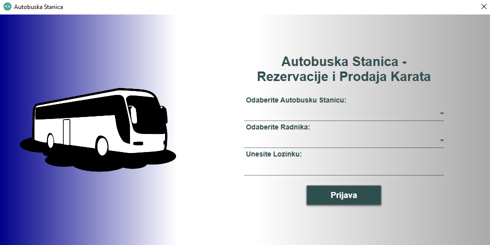

Imate 3 opcije:
- **Odaberite Autobusku Stanicu** – izaberete vašu autobusku stanicu.
- **Odaberite Radnika** – izaberete svoje ime i prezime.
- **Unesite lozinku** – unesete lozinku koja vam je dodijeljena prilikom registracije.

**Primjer unosa:**
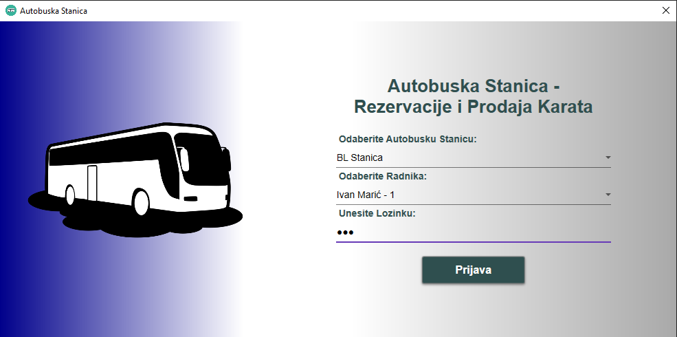

(Nakon prijave, dobićete sledeći prozor)
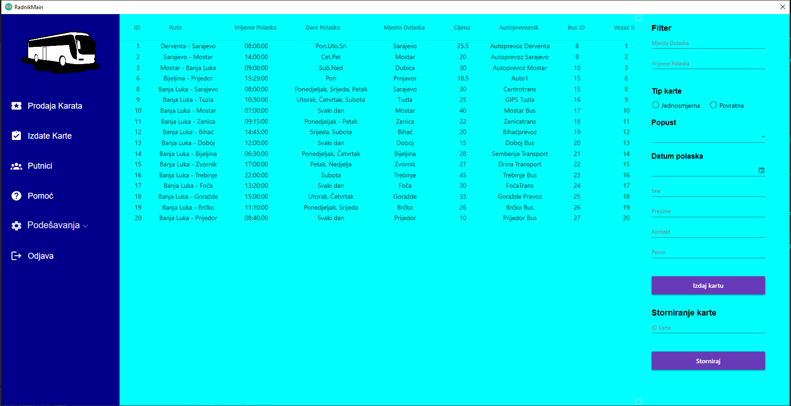

Novi otvoreni prozor se sastoji od 2 dela:
- **Glavni Meni** – meni sa leve strane koji služi za navigaciju između stranica. Sastoji se od stranica, opcije za podešavanja i opcija za odjavu.
- **Stranica** – jedna od stranica: stranica za prodaju karata, stranica za pregled izdatih karata, stranica za pregled putnika i pomoć (korisničko uputstvo).

---

## Izdavanje karata 

Obratimo pažnju na desni dio prozora: 
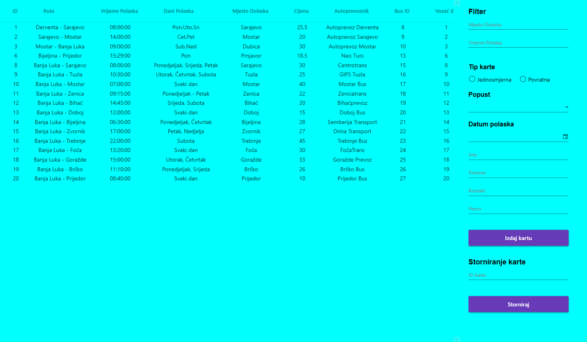

On se sastoji iz dva dijela: lista ruta i kolona koja sadrži opciju za pretragu ruta.

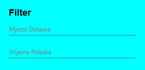

Ovo predstavlja deo za pretragu (filter) određenih ruta na osnovu mjesta dolaska i vremena polaska. Svi podaci se ažuriraju u realnom vremenu.

Prilikom izdavanja karata potrebno je selektovati željenu rutu iz liste i popuniti sljedeća polja:

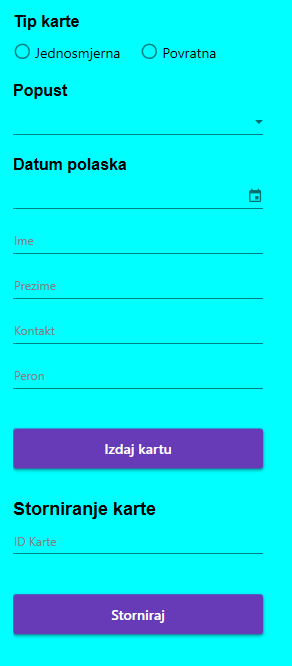

(Nakon što smo popunili sva polja, kliknemo na dugme **Izdaj kartu**.)

Nakon što smo popunili sva neophodna polja i kliknuli na opciju **Izdaj kartu**, iskočiće Vam poruka da ste uspešno izdali kartu, evo jednog primera:

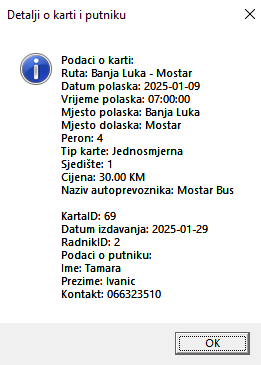

"Izdali smo kartu gde je KartaID 69."

Ukoliko želimo da storniramo kartu, unesemo ID karte koje želimo stornirati u sljedeće polje:

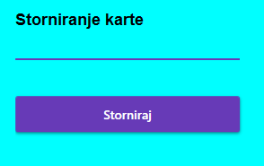

(Nakon unosa, kliknemo na dugme **Storniraj**, ukoliko je uspješno dobićete sljedeće obaveštenje).

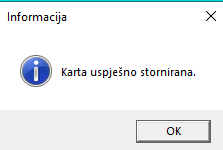

---

## Izdate karte 
Kada kliknemo sa leve strane u glavnom meniju opciju **Izdate Karte**, dobićemo sljedeću stranicu:

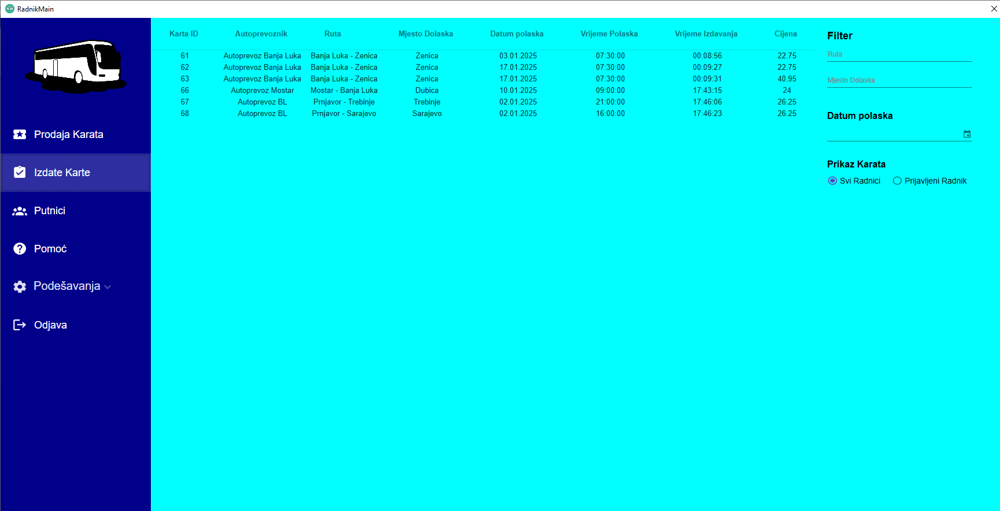

Stranica za pregled izdatih karata izgleda ovako:

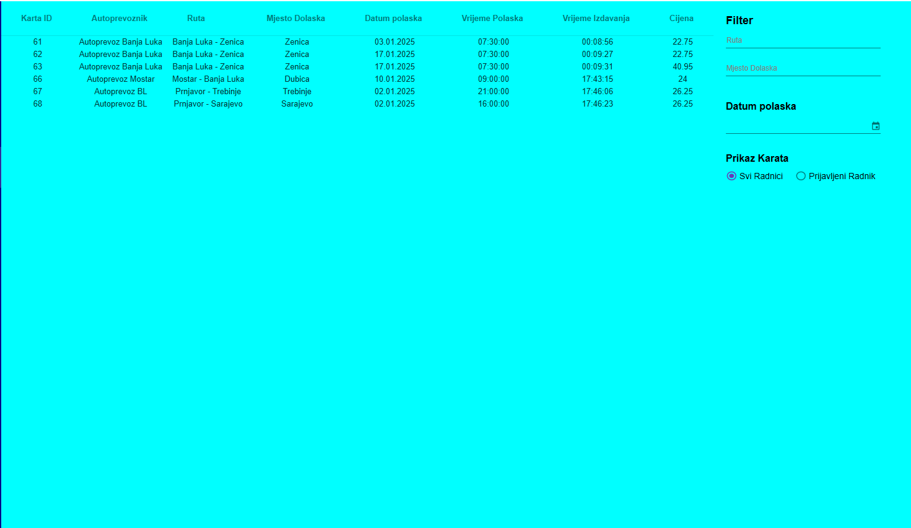

Sa lijeve strane imamo listu izdatih karata koja sadrži podatke o izdatim kartama. Pored toga imamo sledeće opcije:

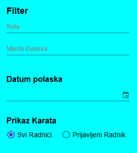

Moguće je pretražiti (filtrirati) izdate karte na osnovu rute, mjesta dolaska i datuma polaska. Svi podaci se ažuriraju u realnom vremenu.

Ispod toga postoji i prikaz karata koja se sastoji od dvije opcije:
- **Svi Radnici** – prikazuje karte koje su izdali svi radnici na toj autobuskoj stanici.
- **Prijavljeni Radnik** – prikazuje samo one karte koje je izdao prijavljeni radnik.

--- 

## Putnici
Klikom na opciju **Putnici** dobijamo sljedeći prozor:

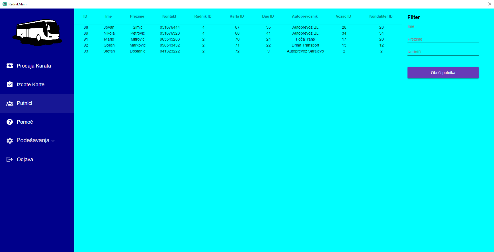

Obratimo pažnju na desni dio prozora:

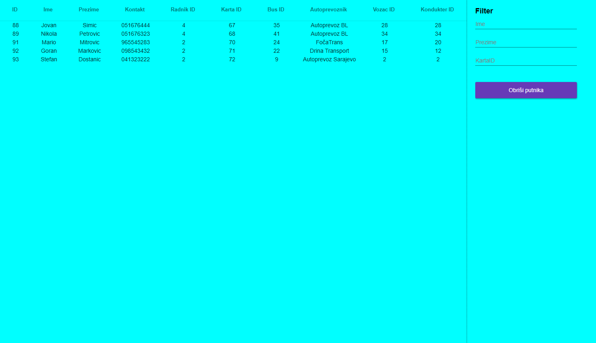

Sa lijeve strane imamo prikaz svih putnika sa dodatnim detaljima kao što su ID busa, autoprevoznik, ID vozača i konduktera sa kojim su putovali.

Takođe imamo i opciju za pretragu (filter) odgovarajućeg putnika na osnovu imena, prezimena i ID karte. Takođe imamo i opciju za brisanje selektovanog putnika.

Ukoliko izbrisemo putnika, obrišemo i njegovu kartu, što predstavlja drugi način brisanja karte. 

Ako selektujemo putnika i kliknemo na dugme **Obriši putnika**, dobićemo sljedeću poruku:

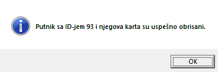

(Time će biti i obrisan i putnik i karta iz baze i samim tim neće biti prikazani na listi).

---

## Podešavanja 
Ukoliko izaberemo u glavnom meniju opciju **Podešavanja**, ponudiće se sledeći izbor opcija:

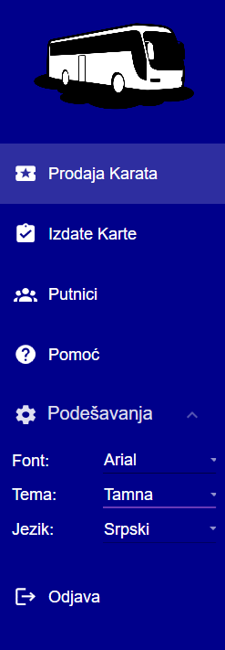

Korisnik ima opciju da promeni sledeće stavke:
- **Font** – Arial, Calibri, Segoe UI, Lionel Classic.
- **Tema** – Svetla, Tamna i Plava.
- **Jezik** – Engleski i Srpski.

**Primer.** Ukoliko se odlučimo na font Calibri sa plavom temom i engleskim jezikom imaćemo sledeći prikaz:

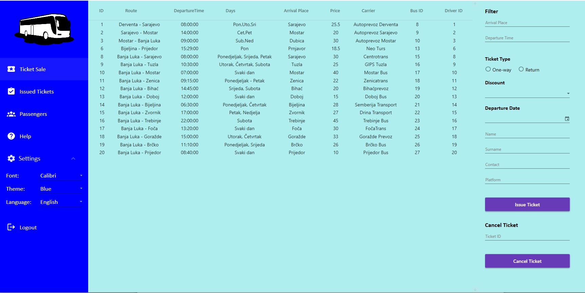

**NAPOMENA:** Vaš izbor se pamti i prilikom sledeće prijave na sistem, aplikacija će izgledati kao kad ste se odjavili.

---

## Odjava
Ukoliko se želite odjaviti, kliknite u glavnom meniju na opciju **Odjava**:

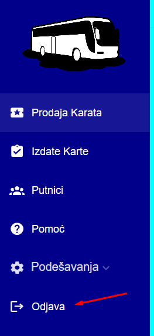

Klikom na dugme **Odjava** zatvara se trenutni prozor i otvara se prozor za prijavu.

--- 
